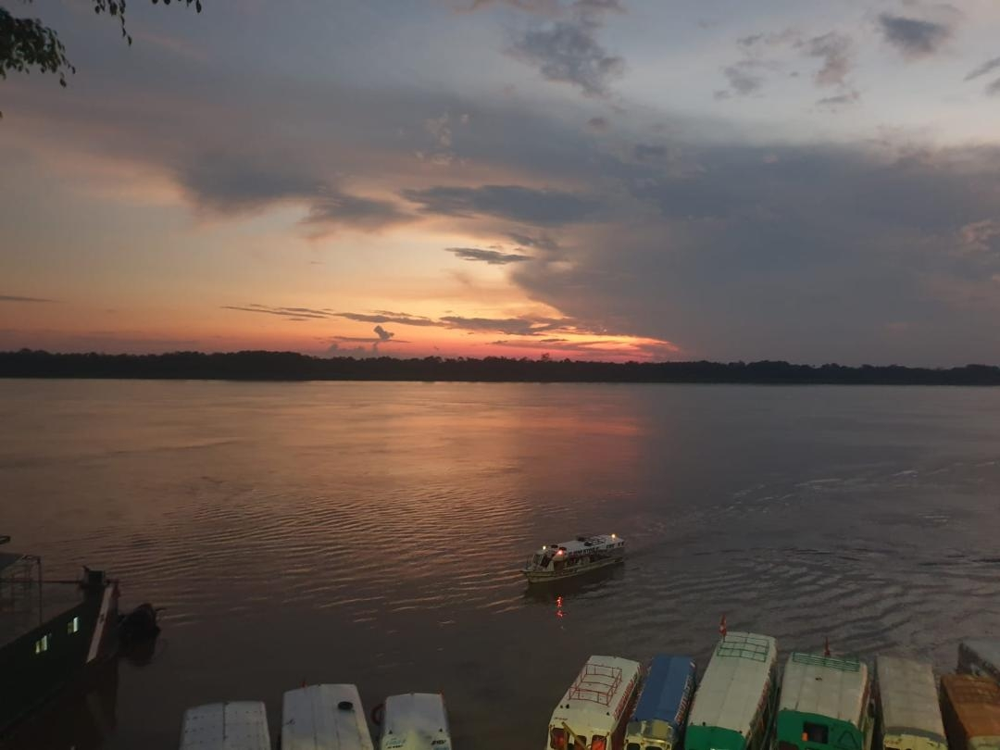

Tamshiyacu, a town with nearly 5,000 residents, is located 29 kilometers south of Iquitos, Peru. Founded in 1911 by Toribio Fernández Bautista, it was intended as a frontier post to solidify Peruvian presence amidst neighboring countries. The town has since evolved into a unique destination, blending historical roots with vibrant experiential tourism.

Fernández Bautista, a tax collector and timber entrepreneur, envisioned Tamshiyacu as a beacon of civilization. He meticulously planned the town with wide streets and public spaces, aiming to create a civilized community in the heart of the Amazon. His vision was not only to establish a stable settlement but also to propagate Peruvian culture and values. Bautista's efforts laid the groundwork for a thriving community, where traditions and modernity coexist harmoniously.

The initial years of Tamshiyacu were marked by significant challenges. The dense Amazon rainforest presented numerous obstacles, from transportation difficulties to health issues. However, the resilient spirit of the settlers, combined with Fernández Bautista's leadership, enabled the community to overcome these hurdles. The town slowly expanded, establishing essential services and infrastructure that supported its growth.

Today, Tamshiyacu is known for its experiential tourism, especially focused on spiritual and cultural immersion. The town boasts at least eighteen lodges that offer tourists a chance to experience ayahuasca ceremonies and other traditional healing practices. These lodges attract visitors from all over the world, seeking a deeper connection with nature and spirituality. The presence of experienced shamans and healers enhances the authenticity of these ayahuasca experiences, providing visitors with profound insights and personal transformations.

The local community has embraced this tourism boom, with many residents participating in and promoting these experiences. The town’s primary and secondary school, named after the renowned ayahuasquero Agustín Rivas, underscores the deep integration of traditional practices within the community. This educational institution not only imparts academic knowledge but also preserves and transmits indigenous wisdom and customs to future generations. The harmonious blend of education and tradition ensures that the cultural heritage of Tamshiyacu remains vibrant and relevant.

The rise of experiential tourism has significantTourismly impacted the local economy. Many residents have found employment in the tourism sector, whether as lodge staff, guides, or artisans. The influx of visitors has also spurred the growth of local businesses, including restaurants, shops, and markets. This economic boost has improved the overall quality of life for many inhabitants, fostering a sense of pride and community resilience.

Tourists visiting Tamshiyacu are generally from Europe and North America, although visitors from diverse regions like Sri Lanka and the UAE also frequent the town. These visitors, typically in their 30s and 40s, are often in search of existential clarity and a break from modern life's complexities. The ceremonial use of ayahuasca, a time-honored practice by local healers, serves as a central draw for these spiritual seekers. The profound impact of these ayahuasca ceremonies often leads to repeat visits and long-lasting connections between the visitors and the community.

Tamshiyacu presents a fascinating paradox. While some locals uphold the traditional values of its founding, emphasizing Catholicism and Peruvian nationalism, others cater to the tourists’ desire for primitive and authentic jungle experiences. This duality is a testament to the town’s ability to adapt and thrive amidst global influences. The juxtaposition of modern amenities with ancient rituals creates a unique atmosphere that captivates visitors and fosters cultural exchange.

Despite the influx of tourists, efforts are being made to preserve the natural environment and cultural heritage of Tamshiyacu. Sustainable tourism practices are promoted, ensuring that the impact on the Amazon rainforest is minimized. Community-led initiatives focus on environmental conservation, such as reforestation projects and wildlife protection programs. These efforts are crucial in maintaining the delicate balance between tourism and ecological preservation.

Tamshiyacu’s unique blend of historical significa nce and modern experiential tourism makes it a captivating destination. Visitors can explore the rich cultural heritage and partake in profound spiritual journeys, making it a truly unforgettable experience. As the town continues to evolve, it remains a testament to the enduring spirit of its founders and the vibrant culture of its inhabitants. Whether you are seeking adventure, spiritual enlightenment, or a deep connection with nature, Tamshiyacu offers an unparalleled experience in the heart of the Amazon, just a short distance from Iquitos. The connection between Iquitos and Tamshiyacu continues to be a vital link, fostering cultural and economic exchange. The town has become a center for spiritual tourism and a center for cultural preservation in the region. With Iquitos serving as a primary gateway, the journey to Tamshiyacu begins with an exploration of the Amazon's cultural and natural wonders.