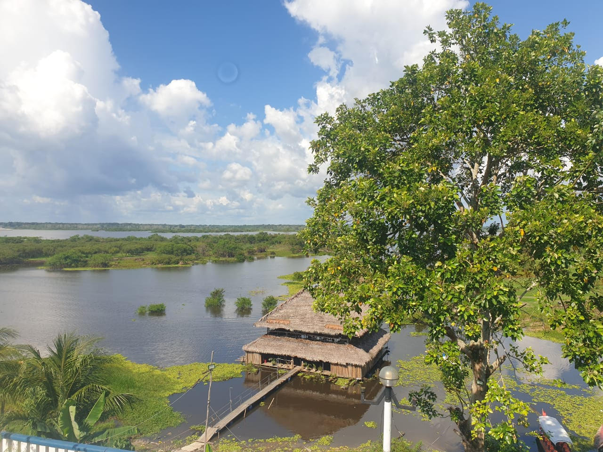

Nestled in the heart of the Peruvian Amazon, Iquitos is a city that pulses with a unique blend of vibrant culture, rich history, and natural beauty. Known as the largest city in the world not accessible by road, Iquitos can only be reached by boat or plane, adding an extra layer of mystique to its allure. This city is a gateway to the Amazon rainforest, offering visitors an unforgettable experience that blends adventure, spirituality, and an immersion into indigenous cultures. Here’s a closer look at what makes Iquitos a must-visit destination.

***The bustling riverside boulevard***

Upon arriving in Iquitos, the first thing that captures your attention is the bustling riverside boulevard. This lively area is a hub of activity, lined with European-style cafes, restaurants, and shops offering a variety of local goods. Street merchants display beautiful handmade souvenirs, from intricate Shipibo tapestries to jewelry featuring polished slices of the ayahuasca vine. This boulevard serves as the heartbeat of the city, where locals and tourists converge, creating a dynamic and cosmopolitan atmosphere.

***Ayahuasca, the spiritual draw***

One of the primary reasons tourists flock to Iquitos is for the ayahuasca experience. Ayahuasca, a powerful hallucinogenic brew made from the Banisteriopsis caapi vine and Psychotria viridis leaves, has been used for centuries by indigenous Amazonian tribes for spiritual and healing purposes. In Iquitos, ayahuasca has become a significant cultural phenomenon, drawing visitors from around the world seeking physical, psychological, or spiritual healing. Numerous tour operators in Iquitos offer ayahuasca retreats, which typically include multi-day packages with ceremonies led by authentic shamans. These retreats often combine the ayahuasca experience with other wellness activities like yoga, meditation, and nature hikes. The ceremonies are deeply rooted in indigenous traditions, providing a profound and transformative journey for participants.

***Exploring the amazon***

Beyond the ayahuasca experience, Iquitos serves as a launching point for exploring the Amazon rainforest. Adventure seekers can embark on boat tours along the Amazon River, where they can witness the stunning biodiversity of the region. From pink river dolphins and exotic birds to lush vegetation and towering trees, the Amazon offers a sensory feast for nature lovers. Guided jungle treks provide an up-close look at the flora and fauna of the rainforest, with opportunities to learn about medicinal plants and indigenous survival techniques. Whether it’s spotting a sloth high in the canopy or hearing the distant calls of howler monkeys, the Amazon promises an adventure like no other.

***Cultural richness and heritage***

The cultural fabric of Iquitos is woven with the threads of its indigenous heritage and the influences of its colonial past. Visitors can explore the city’s history through its architecture, such as the historic Iron House designed by Gustave Eiffel, or the grand Plaza de Armas. The Belen Market, a sprawling and vibrant marketplace, offers a glimpse into the daily lives of the locals. Here, you can find everything from fresh Amazonian produce to traditional herbal remedies and artisanal crafts. The city’s museums, such as the Museum of Indigenous Amazonian Cultures, provide deeper insights into the rich traditions and history of the region’s indigenous peoples. These cultural experiences enhance your understanding of the Amazon’s significance beyond its natural beauty.
 

***Practical tips for visiting iquitos***

<u>Travel</u>

As Iquitos is only accessible by boat or plane, ensure you book your flights in advance. The city’s remoteness adds to its charm but requires careful planning.

<u>Climate</u>

The weather in Iquitos is hot and humid year-round. Light, breathable clothing, insect repellent, and waterproof gear are essential for comfort and protection.

<u>Local Customs</u>

Respect local customs and traditions, especially when participating in ayahuasca ceremonies. These rituals are deeply significant to the indigenous cultures, and understanding their importance enriches the experience.

**Conclusion**

Iquitos is more than just a destination; it’s an adventure into the heart of the Amazon, a journey of spiritual discovery, and an immersion into a vibrant cultural tapestry. Whether you’re seeking the transformative experience of an ayahuasca ceremony, the thrill of Amazonian wildlife, or a deeper understanding of indigenous cultures, Iquitos offers an unparalleled travel experience. Embrace the magic of this unique city, and let the Amazon rainforest leave an indelible mark on your soul.
